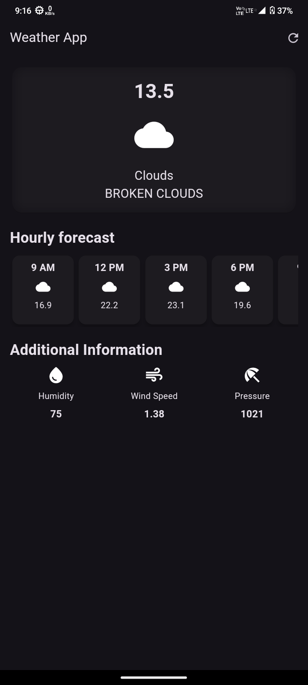
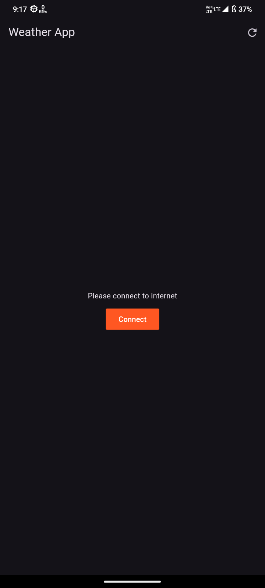

**Weather App**

**Overview**

Weather App is a Flutter application designed to provide real-time weather information using the
OpenWeather API. Users can check the current weather and forecasts for various locations. The app
features custom error handling to enhance user experience.

**Features**

- Current weather updates
- Weather forecasts
- Custom error handling

**Screenshots**

- **Home Screen**  
  

- **Weather Details**  
  

**Getting Started**

To set up and run the Weather App on your local machine, follow these steps:

**1. Prerequisites**

Ensure you have the following installed:

- **Flutter**: Follow
  the [Flutter installation guide](https://flutter.dev/docs/get-started/install).
- **Dart**: Follow the [Dart installation guide](https://dart.dev/get-dart).

**2. Clone the Repository**

Clone the repository from GitHub and navigate into the project directory:

```bash
git clone https://github.com/sanket92011/weather_app.git
cd weather_app
```

**3. Install Dependencies**

Install the necessary Flutter packages:

```bash
flutter pub get
```

**4. Setup API Key**

1. Obtain an API key from [OpenWeather](https://openweathermap.org/api).
2. Create a file named `secrets.dart` in the `lib` directory of your project.
3. Add the following code to `lib/secrets.dart` and replace `'YOUR_API_KEY_HERE'` with your actual
   API key:

   ```dart
   const String openWeatherApiKey = 'YOUR_API_KEY_HERE';
   ```

**5. Run the App**

Launch the app with the following command:

```bash
flutter run
```

**Custom Errors**

The app includes custom error handling to manage various scenarios such as network issues or API
errors, providing user-friendly error messages.

**Contributing**

Contributions are welcome! To contribute:

1. Fork the repository on GitHub.
2. Create a new branch: `git checkout -b feature-branch`
3. Commit your changes: `git commit -am 'Add new feature'`
4. Push the branch: `git push origin feature-branch`
5. Open a pull request on the main repository.

**License**

This project is licensed under the MIT License. See the `LICENSE` file for details.

**Contact**

For questions or feedback, contact [raomigule@gmail.com](mailto:raomigule@gmail.com).

---

Thank you for using Weather App! We hope you find it useful and enjoy contributing to the project.

---

Feel free to replace placeholders with your actual information and adjust sections as needed.
